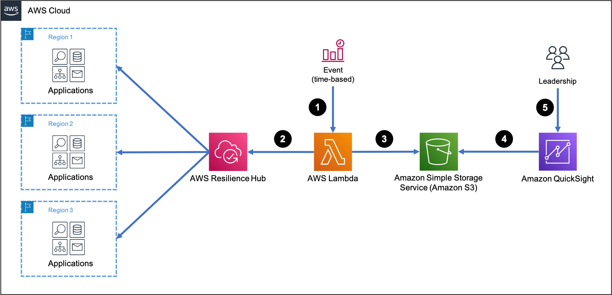

# Resilience reporting dashboard

Create a reporting dashboard on [Amazon QuickSight](https://aws.amazon.com/quicksight/) for applications defined and assessed using AWS Resilience Hub. A resilience dashboard provides a central place that leadership and other stakeholders can visit to get information regarding your organization's mission critical applications. For example, if the compliance team needs to report on certain applications' resilience each month, this dashboard would allow them to self-service that information. For more information on this solution, check out this blog post - [Build a resilience reporting dashboard with AWS Resilience Hub and Amazon QuickSight](https://aws.amazon.com/blogs/mt/resilience-reporting-dashboard-aws-resilience-hub/).

## Architecture



1.	After applications have been defined and assessed within Resilience Hub, a time-based event from Amazon EventBridge invokes an AWS Lambda function.
1.	The Lambda function makes API calls to Resilience Hub, and retrieves and aggregates resilience data for all applications defined within Resilience Hub and generates a CSV file.
1.	The Lambda function uploads this CSV file to an Amazon Simple Storage Service (S3) bucket.
1.	The data in S3 is then ingested into SPICE (Super-fast, Parallel, In-memory Calculation Engine) within QuickSight.
1.	A dashboard is created that contains visuals providing an aggregate view of resilience across all applications defined in Resilience Hub.

## Prerequisites

You will need a QuickSight subscription for this solution to work. 

1. Navigate to the [QuickSight console](https://quicksight.aws.amazon.com/).
1. If you already have a QuickSight subscription, you can skip the following steps and move on to the **Deployment** section.
1. If you do not have a QuickSight subscription, [sign up for a QuickSight subscription](https://docs.aws.amazon.com/quicksight/latest/user/signing-up.html) before proceeding to the **Deployment** section.

## Deployment

The solution is provided as CloudFormation templates that can be used to create CloudFormation stacks, which then provisions all the necessary resources. The deployment happens in three stages, and they need to be executed in this specific order.

**NOTE: This solution must only be deployed once per AWS account, as resilience data is collected from all AWS regions where you are using Resilience Hub in the account.**

### Stage 1:

1. Deploy a CloudFormation stack using the [resilience-csv-generator.yaml](./resilience-csv-generator.yaml) template.
1. Parameters:
    * **Schedule** - This determines the frequency at which the Lambda function will be invoked to refresh data. Refer to [this documentation](https://docs.aws.amazon.com/eventbridge/latest/userguide/eb-create-rule-schedule.html#eb-rate-expressions) for information on supported values. The default value invokes the Lambda function at 24-hour intervals.
    * **Timeout** - This is the timeout for the Lambda function. Increase this depending on how many applications and assessments you have in Resilience Hub. (up to a maximum of 900)
1. After the stack reaches **CREATE_COMPLETE**, navigate to the **Outputs** tab and note down the value for **ResilienceReportBucket**.

### Stage 2:

1. Navigate to [the QuickSight admin panel](https://quicksight.aws.amazon.com/sn/admin) and click on **Security & permissions**. 
    **NOTE: You might have to switch to a different region depending on what your identity region is.**
1. Under **QuickSight access to AWS services** check the **AWS Identity and Access Management (IAM) role in use**:
    * If the value there is **Quicksight-managed role (default)**, click **Manage**.
        * Check the box next to **Amazon S3** and click **Select S3 buckets**.
        * Select the S3 bucket where the resilience report is stored (obtained from the **Outputs** section of **Stage 1** of the deployment).
        * Click **Finish** and then **Save**.
        * Move on to **Stage 3** of the deployment.

    * If the value there is the ARN of a role:
        * Navigate to the IAM console, create a new policy with the following permissions, and attach it to the role displayed on the QuickSight admin panel. 
            **NOTE: you need to first replace the string *YOUR_S3_BUCKET_NAME* with the actual name of the S3 bucket where the resilience report is stored (obtained from the *Outputs* section of *Stage 1* of the deployment).**

        ```
        {
            "Version": "2012-10-17",
            "Statement": [
                {
                    "Effect": "Allow",
                    "Action": "s3:ListAllMyBuckets",
                    "Resource": "arn:aws:s3:::*"
                },
                {
                    "Action": [
                        "s3:ListBucket"
                    ],
                    "Effect": "Allow",
                    "Resource": "arn:aws:s3:::YOUR_S3_BUCKET_NAME"
                },
                {
                    "Action": [
                        "s3:GetObject",
                        "s3:GetObjectVersion"
                    ],
                    "Effect": "Allow",
                    "Resource": "arn:aws:s3:::YOUR_S3_BUCKET_NAME/*"
                }
            ]
        }
        ```

### Stage 3:

1. Deploy a CloudFormation stack using the [resilience-dashboard.yaml](./resilience-dashboard.yaml) template.
1. Parameters:
    * **QuickSightUserARN** - ARN of the QuickSight user with who the dashboard should be shared. You can find your list of QuickSight users by running the [list-users](https://docs.aws.amazon.com/cli/latest/reference/quicksight/list-users.html) API.

## Outputs

After the CloudFormation stack reaches **CREATE_COMPLETE**, navigate to the **Outputs** tab of the stack deployed in **Stage 3** of the deployment to find the URL for the dashboard.

You can see a sample report here - [sample-resilience-report.csv](./sample-resilience-report.csv)

## Configure data refresh

To ensure data in the dashboard is being refreshed, you will need to [configure a data refresh schedule](https://docs.aws.amazon.com/quicksight/latest/user/refreshing-imported-data.html#schedule-data-refresh) for the **ResilienceDataSet**. 

## Troubleshooting

* **Insufficient SPICE capacity** - If you get an error during stack creation that says "Insufficient SPICE capacity", you will need to [purchase more SPICE capacity](https://docs.aws.amazon.com/quicksight/latest/user/managing-spice-capacity.html#spice-capacity-purchasing). Note that SPICE capacity is regional and you will need to purchase capacity in the AWS Region you are deploying this solution. If you do not want to purchase SPICE capacity in a secondary region, deploy the **resilience-dashboard.yaml** template (Stage 3) in the default region for your QuikcSight subscription.
* **Lambda timeout** - If you have a large number of applications and assessments, the Lambda function may time out before it can finish executing. In this situation, increase the value for the **Timeout** parameter (up to a maximum of 900).
