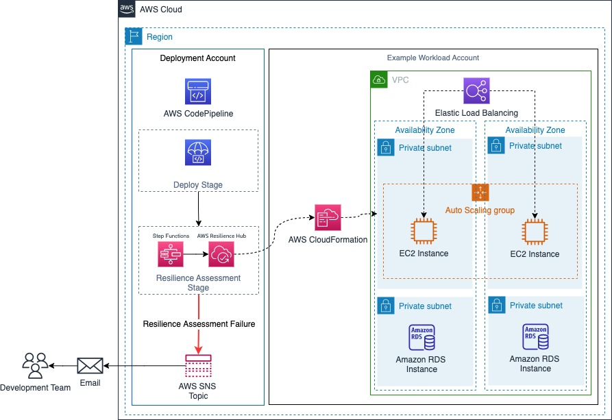
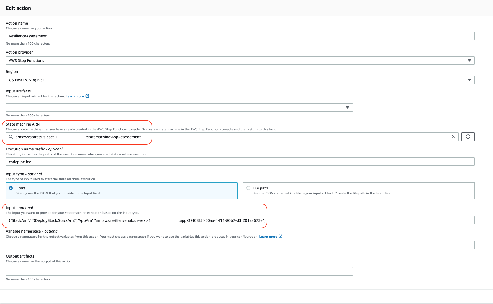

# Continually assessing application resilience with AWS Resilience Hub and AWS CodePipeline

The below diagram shows the resilience assessments automation architecture. AWS CodePipeline, AWS Step Functions, and AWS Resilience Hub are defined in your deployment account while the application AWS CloudFormation stacks are imported from your workload account. This pattern relies on AWS Resilience Hub ability to import CloudFormation stacks from a different accounts, regions, or both, when discovering an application structure.

For the sake of simplicity the solution will describe the steps to deploy this pattern in a single account. 

For multi-account setup, please follow the steps described in this [blog post](https://aws.amazon.com/blogs/architecture/continually-assessing-application-resilience-with-aws-resilience-hub-and-aws-codepipeline/). The key different is to grant proper permissions for cross-account resilience hub access as described in the [AWS documentation](https://docs.aws.amazon.com/resilience-hub/latest/userguide/security-iam-resilience-hub-permissions.html#security-iam-resilience-hub-multi-account)

A step by step workshop is also available on [AWS Workshop Studio](https://catalog.us-east-1.prod.workshops.aws/workshops/2a54eaaf-51ee-4373-a3da-2bf4e8bb6dd3/en-US/cicd-integration)
## Architecture



After applications have been created within AWS Resilience Hub, a AWS CodePipeline Step Function stage will call AWS Resilience hub to assess the updated application resiliency posture. 
The Step Function workflow consists of the following steps:
1. The first step in the workflow is to update the resources associated with the application defined in AWS Resilience Hub by calling ImportResourcesToDraftApplication.
2. Check for the import process to complete using a wait state, a call to DescribeDraftAppVersionResourcesImportStatus and then a choice state to decide whether to progress or continue waiting.
3. Once complete, publish the draft application by calling PublishAppVersion to ensure we are assessing the latest version.
4. Once published, call StartAppAssessment to kick-off a resilience assessment.
5. Check for the assessment to complete using a wait state, a call to DescribeAppAssessment and then a choice state to decide whether to progress or continue waiting.
6. In the choice state, use assessment status from the response to determine if the assessment is pending, in progress or successful.
7. If successful, use the compliance status from the response to determine whether to progress to success or fail. Compliance status will be either “PolicyMet” or “PolicyBreached”.
8. If policy breached, publish onto SNS to alert the development team before moving to fail.

For more information about these AWS SDK calls, please refer to:
- [AWS Resilience Hub API](https://docs.aws.amazon.com/resilience-hub/latest/APIReference/Welcome.html)
- [AWS Step Functions SDK integrations support AWS Resilience Hub](https://aws.amazon.com/about-aws/whats-new/2022/04/aws-step-functions-expands-support-over-20-new-aws-sdk-integrations/)

## Prerequisites

This solution assumes that you already have:

1. An application CI/CD CodePipeline
2. An AWS Resilience Hub Application defined based on the cloudformation stack resources.

## Deployment

The solution is provided as CloudFormation templates that can be used to create CloudFormation stacks, which then provisions all the necessary resources and most importantly AWS Step Function to be called by the CodePipeline Stage.

**NOTE: This solution must only be deployed once per AWS account, the Step Function can be called by various pipelines to trigger the application resiliency assessment**

### Stage 1:

1. Deploy a CloudFormation stack using the [AWSResilienceHubCICDStepFunction.yaml](./AWSResilienceHubCICDStepFunction.yaml) template.
2. After the stack reaches **CREATE_COMPLETE**, navigate to the **Resources** tab and note down the Physical ID (ARN) for **AWS::StepFunctions::StateMachine** resource.

### Stage 2:

1. Now that we have the AWS Step Function created, we need to integrate it into our pipeline. When adding the stage, you need to pass the ARN of the stack which was deployed in the previous Deploy stage as well as the ARN of the application in AWS Resilience Hub. These will be required on the AWS SDK calls and you can pass this in as a literal.

In other words, the Step Function will need a json input similar to the one highlighted below, which we are configuring at the level of the new CodePipeline stage input field.
```json
{"StackArn":"<ApplicationCloudformationStack_ARN>","AppArn":"<ResilienceHubApplication_ARN>"}
```


2. Make sure that the CodePipeline IAM Role has the correct permissions trigger a step function.
   1.  Check the CodePipeline IAM Role used by clicking on the [Settings](https://docs.aws.amazon.com/codepipeline/latest/userguide/pipelines-create-service-role-console.html) menu after opening the pipeline in question
   2. Add the below permissions to the pipeline IAM role idenfitied in step 1.
   
   ---
    **NOTE**

   Make sure to replace **<StateMachine_ARN>** with the Physical ID (ARN) for **AWS::StepFunctions::StateMachine** resource
   
   ---

   ```json
   {
            "Effect": "Allow",
            "Action": [
                "states:DescribeExecution",
                "states:DescribeStateMachine",
                "states:StartExecution"
            ],
            "Resource": "<StateMachine_ARN>"
        },
   ```

## References
- [Continually assessing application resilience with AWS Resilience Hub and AWS CodePipeline blog post](https://aws.amazon.com/blogs/architecture/continually-assessing-application-resilience-with-aws-resilience-hub-and-aws-codepipeline/).
- [Using AWS Resilience Hub to monitor resilient architectures Workshop](https://catalog.us-east-1.prod.workshops.aws/workshops/2a54eaaf-51ee-4373-a3da-2bf4e8bb6dd3/en-US)
